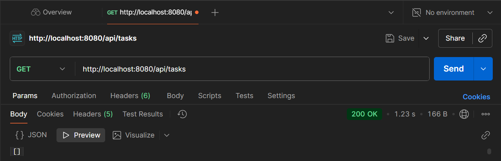
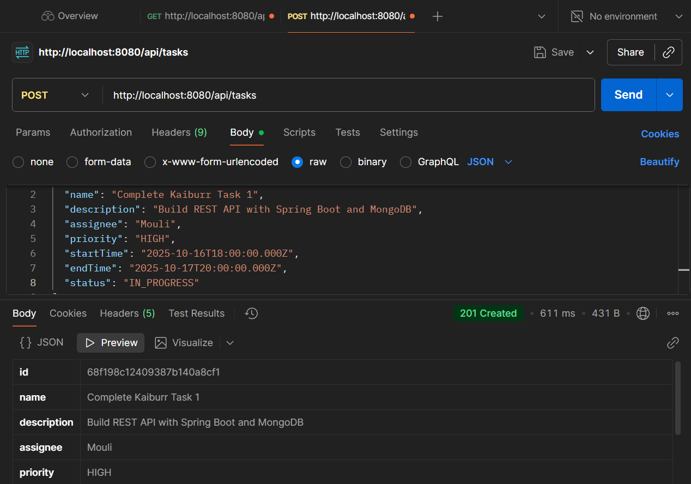
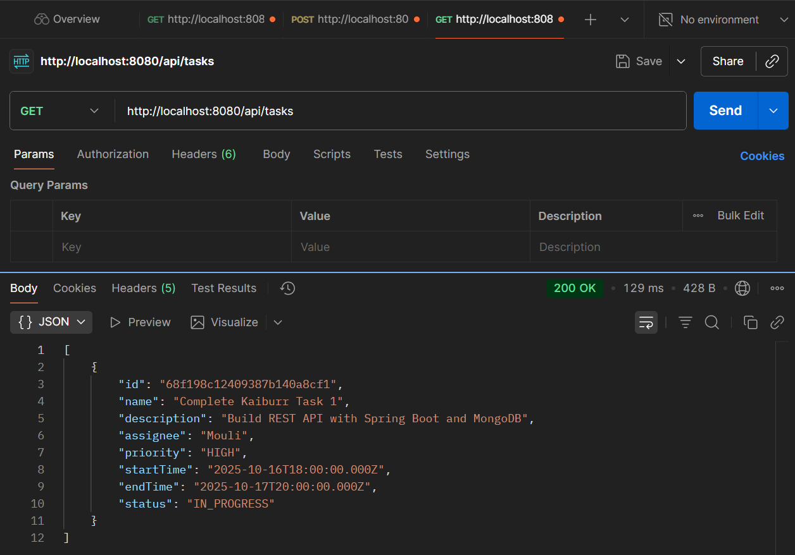
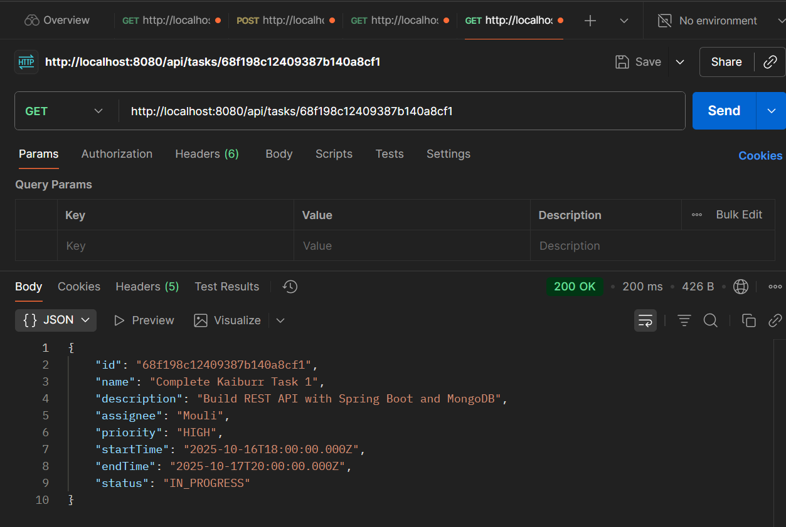
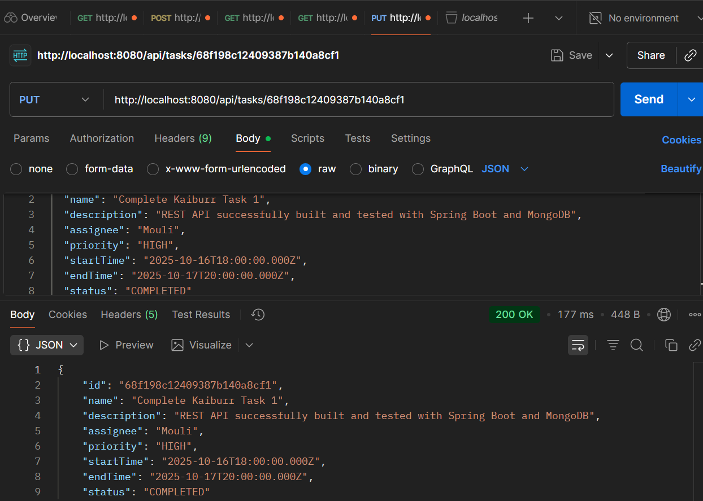
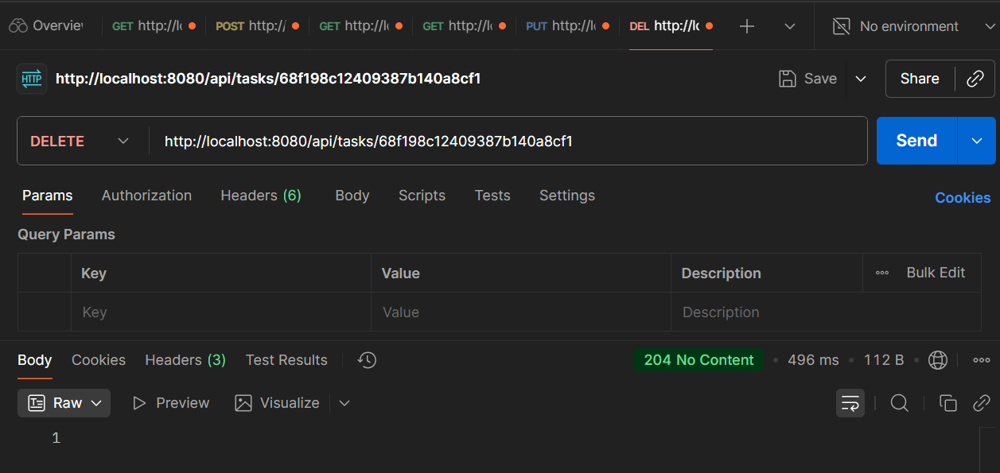
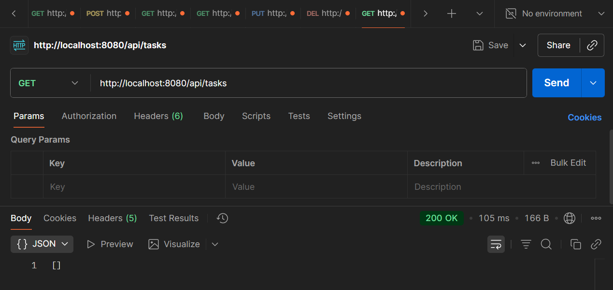

# Task Management REST API

A Spring Boot REST API for managing tasks with CRUD operations, built as part of the Kaiburr assessment.

## Project Overview

This application provides a RESTful web service for task management operations. It allows users to create, read, update, and delete tasks through HTTP endpoints. The application uses MongoDB Atlas as the database for persistent storage.

## Technologies Used

- **Java 24**
- **Spring Boot 3.5.6**
- **Spring Data MongoDB**
- **MongoDB Atlas** (Cloud Database)
- **Maven** (Build Tool)
- **Lombok** (Reduce Boilerplate Code)
- **Jakarta Validation** (Input Validation)

## Task Model

Each task contains the following fields:

- `id` - Unique identifier (auto-generated)
- `name` - Task name (required)
- `description` - Task description
- `assignee` - Person assigned to the task
- `priority` - Task priority level
- `startTime` - Task start date and time
- `endTime` - Task end date and time
- `status` - Current status of the task

## Prerequisites

Before running this application, make sure you have:

- Java Development Kit (JDK) 17 or higher
- Maven 3.6 or higher
- MongoDB Atlas account (or local MongoDB installation)
- An IDE (IntelliJ IDEA, Eclipse, VS Code, etc.)

## Installation and Setup

### 1. Clone the Repository

```bash
git clone <your-repository-url>
cd task_manager
```

### 2. Configure MongoDB Connection

Open `src/main/resources/application.properties` and update the MongoDB URI:

```properties
spring.data.mongodb.uri=mongodb+srv://<username>:<password>@<cluster-url>/taskdb?retryWrites=true&w=majority&appName=Cluster0
server.port=8080
```

Replace `<username>`, `<password>`, and `<cluster-url>` with your MongoDB Atlas credentials.

### 3. Build the Project

```bash
mvn clean install
```

### 4. Run the Application

```bash
mvn spring-boot:run
```

Or run directly from your IDE by executing the main class `task_managerApplication.java`.

The application will start on `http://localhost:8080`

## API Endpoints

### Base URL
```
http://localhost:8080/api/tasks
```

### Available Endpoints

| Method | Endpoint | Description | Request Body |
|--------|----------|-------------|--------------|
| GET | `/api/tasks` | Retrieve all tasks | None |
| GET | `/api/tasks/{id}` | Retrieve a specific task by ID | None |
| POST | `/api/tasks` | Create a new task | Task JSON |
| PUT | `/api/tasks/{id}` | Update an existing task | Task JSON |
| DELETE | `/api/tasks/{id}` | Delete a task | None |

### Request/Response Examples

#### Create a Task (POST)

**Request:**
```json
POST /api/tasks
Content-Type: application/json

{
"name": "Complete Kaiburr Task 1",
"description": "Build REST API with Spring Boot and MongoDB",
"assignee": "Mouli",
"priority": "HIGH",
"startTime": "2025-10-16T18:00:00.000Z",
"endTime": "2025-10-17T20:00:00.000Z",
"status": "IN_PROGRESS"
}
```

**Response:**
```json
{
  "id": "68f198c12409387b140a8cf1",
  "name": "Complete Kaiburr Task 1",
  "description": "Build REST API with Spring Boot and MongoDB",
  "assignee": "Mouli",
  "priority": "HIGH",
  "startTime": "2025-10-16T18:00:00.000Z",
  "endTime": "2025-10-17T20:00:00.000Z",
  "status": "IN_PROGRESS"
}
```

#### Get All Tasks (GET)

**Request:**
```
GET /api/tasks
```

**Response:**
```json
[
  {
    "id": "68f198c12409387b140a8cf1",
    "name": "Complete Kaiburr Task 1",
    "description": "Build REST API with Spring Boot and MongoDB",
    "assignee": "Mouli",
    "priority": "HIGH",
    "startTime": "2025-10-16T18:00:00.000Z",
    "endTime": "2025-10-17T20:00:00.000Z",
    "status": "IN_PROGRESS"
  }
]
```

#### Get Task by ID (GET)

**Request:**
```
GET /api/tasks/68f198c12409387b140a8cf1
```

**Response:**
```json
{
  "id": "68f198c12409387b140a8cf1",
  "name": "Complete Kaiburr Task 1",
  "description": "Build REST API with Spring Boot and MongoDB",
  "assignee": "Mouli",
  "priority": "HIGH",
  "startTime": "2025-10-16T18:00:00.000Z",
  "endTime": "2025-10-17T20:00:00.000Z",
  "status": "IN_PROGRESS"
}
```

#### Update Task (PUT)

**Request:**
```json
PUT /api/tasks/68f198c12409387b140a8cf1
Content-Type: application/json

{
"name": "Complete Kaiburr Task 1",
"description": "REST API successfully built and tested",
"assignee": "Mouli",
"priority": "HIGH",
"startTime": "2025-10-16T18:00:00.000Z",
"endTime": "2025-10-17T20:00:00.000Z",
"status": "COMPLETED"
}
```

**Response:**
```json
{
  "id": "68f198c12409387b140a8cf1",
  "name": "Complete Kaiburr Task 1",
  "description": "REST API successfully built and tested",
  "assignee": "Mouli",
  "priority": "HIGH",
  "startTime": "2025-10-16T18:00:00.000Z",
  "endTime": "2025-10-17T20:00:00.000Z",
  "status": "COMPLETED"
}
```

#### Delete Task (DELETE)

**Request:**
```
DELETE /api/tasks/68f198c12409387b140a8cf1
```

**Response:**
```
204 No Content
```

## Testing the API

You can test the API endpoints using:

- **Postman** - Import the requests and test each endpoint
- **cURL** - Use command line to send HTTP requests
- **Browser** - For GET requests only
- **Swagger UI** - If integrated

### Testing with Postman

1. Open Postman
2. Create a new request
3. Set the HTTP method (GET, POST, PUT, DELETE)
4. Enter the endpoint URL
5. For POST/PUT requests, add request body in JSON format
6. Click Send

## Project Structure

```
task_manager/
├── src/
│   ├── main/
│   │   ├── java/
│   │   │   └── com/kaiburr/task_manager/
│   │   │       ├── controller/
│   │   │       │   └── TaskController.java
│   │   │       ├── model/
│   │   │       │   └── Task.java
│   │   │       ├── repository/
│   │   │       │   └── TaskRepository.java
│   │   │       ├── service/
│   │   │       │   └── TaskService.java
│   │   │       ├── exception/
│   │   │       │   └── TaskNotFoundException.java
│   │   │       └── task_managerApplication.java
│   │   └── resources/
│   │       └── application.properties
│   └── test/
├── screenshots/
│   ├── 1_GET_All_Tasks_Empty.png
│   ├── 2_POST_Create_Task.png
│   ├── 3_GET_All_Tasks_With_Data.png
│   ├── 4_GET_Task_By_ID.png
│   ├── 5_PUT_Update_Task.png
│   ├── 6_DELETE_Task.png
│   └── 7_GET_After_Delete.png
├── pom.xml
└── README.md
```

## API Testing Screenshots

All API endpoints have been tested using Postman. Below are screenshots demonstrating each operation:

### 1. GET All Tasks (Empty State)
Initial state with no tasks in the database.



---

### 2. POST - Create New Task
Creating a new task with all required fields.



---

### 3. GET All Tasks (With Data)
Retrieving all tasks after creation, showing the created task in the response.



---

### 4. GET Task by ID
Fetching a specific task using its unique identifier.



---

### 5. PUT - Update Task
Updating an existing task's details (changed status from IN_PROGRESS to COMPLETED).



---

### 6. DELETE Task
Removing a task from the database.



---

### 7. GET All Tasks (After Deletion)
Verifying the task was successfully deleted - database returns to empty state.



## Error Handling

The API includes proper error handling:

- `404 Not Found` - When a task with the given ID doesn't exist
- `400 Bad Request` - When the request body is invalid
- `500 Internal Server Error` - For unexpected server errors

## Future Enhancements

Potential improvements for this application:

- Add user authentication and authorization
- Implement pagination for large datasets
- Add filtering and sorting capabilities
- Include task categories or tags
- Add task priority levels validation
- Implement task assignment notifications
- Add API documentation with Swagger/OpenAPI

## Author

Mouli - Kaiburr Assessment Task 1

## License

This project is created for assessment purposes.

## Acknowledgments

- Spring Boot Documentation
- MongoDB Atlas Documentation
- Kaiburr Assessment Team